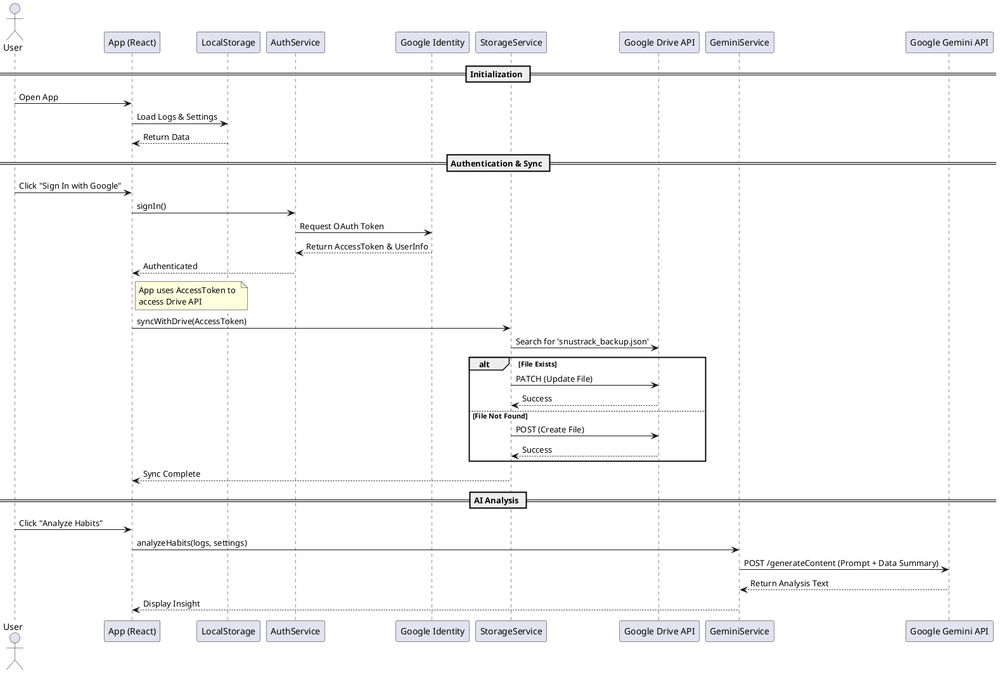

# System Architecture

## Overview
SnusTrack AI is a mobile application built with React and Capacitor, designed to help users track and analyze their nicotine consumption. The application leverages a serverless architecture, utilizing Google Cloud services for storage, authentication, and artificial intelligence, coordinated through a Firebase project configuration.

## Technology Stack

### Frontend
- **Framework**: React (Vite)
- **Mobile Runtime**: Capacitor (Android)
- **Language**: TypeScript
- **UI Library**: Lucide React (Icons), Standard CSS

### Backend & Cloud Services
- **Authentication**:  
  - **Service**: Google Sign-In (via `@codetrix-studio/capacitor-google-auth`)
  - **Infrastructure**: Firebase Authentication / Google Cloud Identity
  - **Role**: Handles user login and provides OAuth tokens for accessing Google Drive.

- **Storage (User Data)**:  
  - **Service**: Google Drive API (v3)
  - **Type**: Personal User Storage (App Data / File Scope)
  - **Mechanism**: The app directly interacts with the user's Google Drive to read/write a `snustrack_backup.json` file. This ensures privacy and data ownership as data remains in the user's personal drive.
  - **Local Sync**: Data is cached locally using the device's `localStorage` for offline capability.

- **Artificial Intelligence**:  
  - **Service**: Google Gemini API (`@google/genai`)
  - **Model**: `gemini-2.5-flash`
  - **Role**: Analyzes consumption logs to provide motivational insights and usage patterns.

- **Monetization**:
  - **Service**: AdMob
  - **Integration**: `@capacitor-community/admob`

## Data Flow
1.  **Local First**: User actions (logging usage) are saved immediately to local storage.
2.  **Cloud Sync**: When the user signs in, the app attempts to sync (upload/download) the `snustrack_backup.json` file from their Google Drive.
3.  **AI Analysis**: On demand, a summary of the local logs is sent to the Gemini API to generate text-based analysis.

## Sequence Diagram
The following PlantUML diagram illustrates the core user flows: Authentication, Data Sync, and AI Analysis.

## Key Configuration Files
- **`capacitor.config.ts`**: Configures the App ID (`com.snustrack.app`) and Google Auth scopes.
- **`android/app/google-services.json`**: Links the Android app to the Firebase/Google Cloud project for authentication and services.
- **`services/storageService.ts`**: Contains the logic for direct REST calls to Google Drive.
